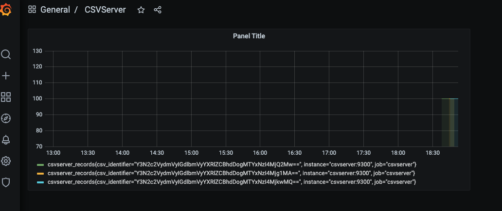

## Troubleshooting

### Part 1
I've logged in to the docker container

`docker run -it infracloudio/csvserver bash`

I've tried multiple ways to reverse engineering the container to see the different layers

```
docker history --no-trunc 8cb989ef80b5 
`dfimage` - a command to reverse engineering from image to layers
docker inspect infracloudio/csvserver
```

basically found that `./csvserver` GO binary file required a filename called `./csvserver inputdata` and which runs on port `9030`.

```
docker run -v `pwd`/inputdata:/csvserver/inputdata infracloudio/csvserver
```

### Part 2

Docker Compose 

```
docker-compose up &
```

### Part 3

Added Prometheus and Grafana for Fun

```
docker-compose up &
```

For Grafana, Did the configuration manually, `http://localhost:3000` and use the default password as `admin/admin` and configure the DS as to use Prometheus with server as `browser` with hostname as `http://localhost:9090`. 




